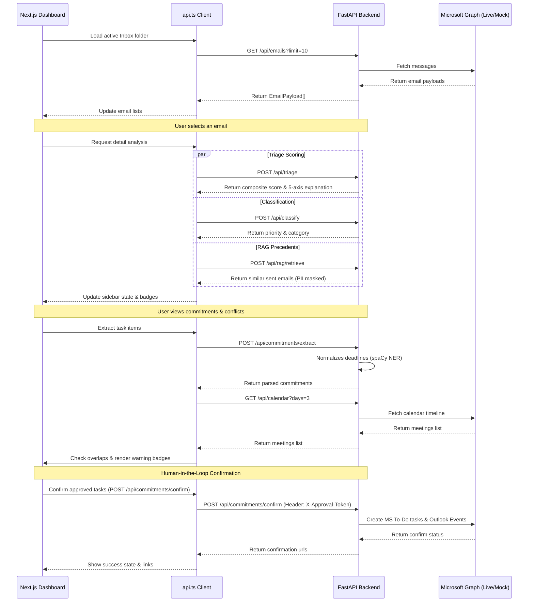

# MailMind v2 — Integration & Full-Stack Status Report

This document evaluates the integration quality between the Next.js frontend and the FastAPI backend in **MailMind v2**. It maps the data flows, verifies the current connection status, outlines the system maturity level, and lists areas that require immediate developer attention.

---

## 🔌 1. Frontend-Backend Connectivity Map

The frontend communicates with the backend solely via asynchronous HTTP/JSON API calls defined in [api.ts](file:///c:/Users/kmani/Documents/GitHub/mailmind/frontend/lib/api.ts). The interaction pattern is structured as follows:

---

## ✅ 2. Connection Status Verification

Overall, the frontend and backend are **properly connected** and share a unified data contract. The key integration aspects verified include:

* **Authentication Sync**: The MSAL Device Code Flow is synchronized between both layers. The frontend polls `/api/auth/login-poll` periodically during device sign-in, caching the authenticated user context successfully.
* **CORS Compliance**: The backend [main.py](file:///c:/Users/kmani/Documents/GitHub/mailmind/backend/app/main.py#L34-L40) registers the standard `CORSMiddleware`, allowing headers, credentials, and origins loaded from `settings.frontend_origin` (`http://localhost:3000` by default).
* **Schema Adherence**: The frontend custom hooks map variables cleanly onto the backend Pydantic models (e.g. `EmailPayload`, `TriageResult`, `CommitmentItem`).
* **State Management**: The frontend hooks ([useEmails.ts](file:///c:/Users/kmani/Documents/GitHub/mailmind/frontend/hooks/useEmails.ts) and [useEmailDetail.ts](file:///c:/Users/kmani/Documents/GitHub/mailmind/frontend/hooks/useEmailDetail.ts)) handle async requests in parallel and update the view reactively, preventing page lockups.
* **Dual-Layer Caching & Deduplication**:
  * **Frontend Local Storage**: Caches already loaded and scored emails. When emails are fetched again, their triage scores are merged instantly, and background triage updates are skipped, dropping load-time calls to exactly zero.
  * **Frontend Detail Cache**: Caches details (classification + precedents) when clicking between emails, preventing hitting the network repeatedly on tab clicks.
  * **Backend TTL Cache**: Caches triage, classification, RAG retrieval, and extracted commitments by unique email ID or content hash.
  * **Commitment Deduplication**: Tracks previously confirmed tasks/events in the backend commitments cache. Re-confirming commitments does not call external Microsoft Graph endpoints, avoiding duplicates and reusing the original URLs.

---

## 📊 3. Full-Stack Implementation Status

The table below summarizes the implementation status of all major features across the stack:

| Feature Area | Backend Status | Frontend Status | Overall Status | Notes |
| :--- | :--- | :--- | :--- | :--- |
| **Authentication** | Fully supported (Live MSAL / Mock fallback) | Fully supported (Device flow GUI / Demo entry) | **Production Ready** | Bypasses login screen dynamically when in Mock Mode. |
| **Email Ingestion** | Ingest API & webhook queue active | Fetches email list reactively | **Production Ready** | Decoupled via in-memory deque. |
| **Explainable Triage** | Five-axis scorers + composite score | Interactive badges + detail tooltip | **Production Ready** | Transparent weighting scheme visible to users. |
| **RAG Retrieval** | ChromaDB semantic search + PII masking | Precedent citation displays | **Production Ready** | Sub-millisecond local search times. |
| **Response Drafting** | Precedent injector prompt template | Editable response text box | **Functional** | Drafts are generated client-side from injected context prompts. |
| **Commitment Gate** | extraction API + MS Graph writer | Selection checkboxes + write-back button | **Production Ready** | Creates tasks in Microsoft To-Do and meetings in Outlook. |
| **Conflict Checking** | 72-hour window comparison | Overlap conflict warning badge | **Production Ready** | Computes absolute hour offsets. |
| **System Validation** | `/api/evaluate` endpoint using golden dataset | No administrative GUI for evaluation | **Development Ready** | Evaluation is triggered programmatically or via backend route. |

---

## ✅ 4. Resolved Integration & Configuration Items (Developer Checklist)

The following integration and security items have been fully resolved in the codebase:

### 4.1 Dynamic API Endpoint in `ThreadView.tsx`
* **File**: [ThreadView.tsx](file:///c:/Users/kmani/Documents/GitHub/mailmind/frontend/components/detail/ThreadView.tsx#L26)
* **Status**: **Resolved**
* **Change**: Replaced the hardcoded URL `http://localhost:8000` with the dynamically imported `BASE` constant from `api.ts`, which respects the `process.env.NEXT_PUBLIC_API_URL` environment configuration.

### 4.2 Dynamic API Base Indicator in `Header.tsx`
* **File**: [Header.tsx](file:///c:/Users/kmani/Documents/GitHub/mailmind/frontend/components/layout/Header.tsx#L60)
* **Status**: **Resolved**
* **Change**: Replaced the hardcoded string indicator with the dynamic `{BASE}` parameter to ensure accurate configuration reporting.

### 4.3 Secure Fallback Authorization Token Gate
* **Files**: [routes.py](file:///c:/Users/kmani/Documents/GitHub/mailmind/backend/app/api/routes.py#L57-L61)
* **Status**: **Resolved**
* **Change**: Implemented a fail-safe check in the backend: if the default `'secret-approval-token'` is used while running in live mode (`USE_MOCK_GRAPH = False`), the server raises an `HTTP_500_INTERNAL_SERVER_ERROR` forcing the administrator to supply custom env credentials.

### 4.4 spaCy Model Availability Startup Check
* **File**: [main.py](file:///c:/Users/kmani/Documents/GitHub/mailmind/backend/app/main.py#L19-L32)
* **Status**: **Resolved**
* **Change**: Added a load check inside the FastAPI lifespan handler. The backend now tests if it can load `en_core_web_sm` on boot and prints an explicit warning, avoiding silent fallback degradations.

### 4.5 Improved Rate Limiter UX
* **File**: [api.ts](file:///c:/Users/kmani/Documents/GitHub/mailmind/frontend/lib/api.ts#L72-L80)
* **Status**: **Resolved**
* **Change**: Added specific response status checks in the `ingestEmail` frontend function, intercepting `429` status codes and throwing a descriptive message: `'Rate limit exceeded. Please try again in 1 minute.'`.
