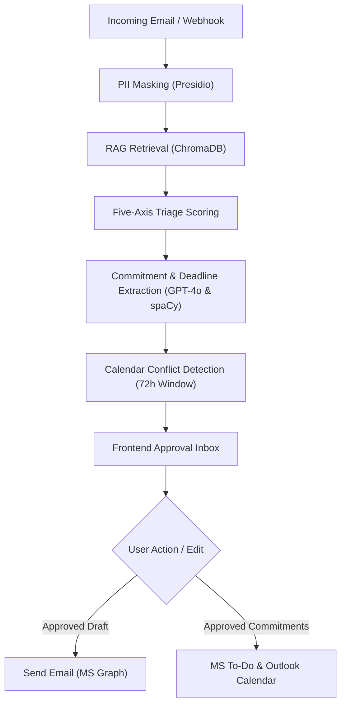

# MailMind v2 — Project Reference Guide

MailMind v2 is an AI-powered email productivity platform that helps knowledge workers prioritize emails, draft context-aware responses, extract commitments, and reduce inbox overload while keeping a human-in-the-loop for every outgoing message.

---

## 🏗️ System Architecture & Workflow

The core pipeline processes incoming emails through several intelligent layers before presenting them in the frontend dashboard for user approval:



---

## 🛠️ Technology Stack

### Backend
- **Framework**: FastAPI (Python 3.12+)
- **Runner**: Uvicorn
- **NLP & Entities**: spaCy (`en_core_web_sm`) for relative timeline parsing and deadline normalization.
- **Vector Database**: ChromaDB (local search index for sent precedents).
- **AI / LLMs**: Azure OpenAI (`gpt-4o`, `text-embedding-ada-002`).
- **Security**: Microsoft Presidio (PII scrubbing).
- **Authentication**: MSAL (Microsoft Authentication Library) for OAuth2 delegated token acquisition.

### Frontend
- **Framework**: Next.js 16.2.7 (React 19)
- **Styling**: Tailwind CSS 4
- **Language**: TypeScript 5

---

## 📂 Key Codebase Components

Click any path below to open the corresponding file directly in your editor:

### Backend Key Files
- [backend/app/main.py](file:///c:/Users/kmani/Documents/GitHub/mailmind/backend/app/main.py) — FastAPI initialization, lifespan handlers, and CORS/instrumentation configurations.
- [backend/app/config/settings.py](file:///c:/Users/kmani/Documents/GitHub/mailmind/backend/app/config/settings.py) — Configuration settings loaded from environment variables (e.g. thresholds, API endpoints, mock switches).
- [backend/app/api/routes.py](file:///c:/Users/kmani/Documents/GitHub/mailmind/backend/app/api/routes.py) — Routing layer exposing HTTP endpoints for the frontend.
- [backend/app/models/schemas.py](file:///c:/Users/kmani/Documents/GitHub/mailmind/backend/app/models/schemas.py) — Pydantic models declaring API validation schemas for requests and responses.
- [backend/app/services/cache.py](file:///c:/Users/kmani/Documents/GitHub/mailmind/backend/app/services/cache.py) — Ephemeral thread-safe TTL memory caches for triage, classification, precedents, and commitments.
- [backend/app/services/graph.py](file:///c:/Users/kmani/Documents/GitHub/mailmind/backend/app/services/graph.py) — Client integration for Microsoft Graph API (handling user auth, email ingestion, calendars, tasks, and directory queries).
- [backend/app/services/classification.py](file:///c:/Users/kmani/Documents/GitHub/mailmind/backend/app/services/classification.py) — urgencies/categories analyzer mapping contexts using Azure OpenAI GPT-4o.
- [backend/app/services/scorers.py](file:///c:/Users/kmani/Documents/GitHub/mailmind/backend/app/services/scorers.py) — Multi-axis classification scoring models (Deadline, Sender Authority, Sentiment, Decay, Action Type).
- [backend/app/services/commitments.py](file:///c:/Users/kmani/Documents/GitHub/mailmind/backend/app/services/commitments.py) — Parser and processor for calendar events/task confirmations.
- [backend/app/services/rag.py](file:///c:/Users/kmani/Documents/GitHub/mailmind/backend/app/services/rag.py) — Precedent indexer, semantic retriever, and PII-masking tools.

### Frontend Key Files
- [frontend/package.json](file:///c:/Users/kmani/Documents/GitHub/mailmind/frontend/package.json) — Scripts, project dependencies, and Tailwind post-css settings.
- [frontend/app/page.tsx](file:///c:/Users/kmani/Documents/GitHub/mailmind/frontend/app/page.tsx) — Login landing page with auth status check and MSAL device code flow trigger.
- [frontend/app/dashboard/page.tsx](file:///c:/Users/kmani/Documents/GitHub/mailmind/frontend/app/dashboard/page.tsx) — Entry dashboard page orchestrating state, custom hooks, and components.
- [frontend/lib/api.ts](file:///c:/Users/kmani/Documents/GitHub/mailmind/frontend/lib/api.ts) — Axios/fetch wrapper containing dynamic API base configuration and rate limiting status interceptors.
- [frontend/lib/types.ts](file:///c:/Users/kmani/Documents/GitHub/mailmind/frontend/lib/types.ts) — Shared TypeScript types matching backend schemas.
- [frontend/lib/mockData.ts](file:///c:/Users/kmani/Documents/GitHub/mailmind/frontend/lib/mockData.ts) — Mock datasets for offline local development and testing.

### Key Frontend Components
- [Header.tsx](file:///c:/Users/kmani/Documents/GitHub/mailmind/frontend/components/layout/Header.tsx) — Displays the top navigation bar, active connection status (Live Account vs Mock Mode), and current user information.
- [Sidebar.tsx](file:///c:/Users/kmani/Documents/GitHub/mailmind/frontend/components/layout/Sidebar.tsx) — Handles collapsible mailboxes (Inbox, Sent, Starred, Important, Drafts, Trash, Spam, Social, Promotions).
- [EmailList.tsx](file:///c:/Users/kmani/Documents/GitHub/mailmind/frontend/components/inbox/EmailList.tsx) — Displays lists of emails in folders, supporting search, stars, and prioritization badge orders.
- [EmailDetail.tsx](file:///c:/Users/kmani/Documents/GitHub/mailmind/frontend/components/detail/EmailDetail.tsx) — Entry panel orchestrating selected email details, triage axis explainer, draft panel, and commitments.
- [DraftPanel.tsx](file:///c:/Users/kmani/Documents/GitHub/mailmind/frontend/components/detail/DraftPanel.tsx) — AI response draft editor containing a editable text box and direct send approval trigger.
- [CommitmentItem.tsx](file:///c:/Users/kmani/Documents/GitHub/mailmind/frontend/components/commitments/CommitmentItem.tsx) — Renders interactive checklist cards for extracted todo items, showing calendar conflicts and confirmation links.
- [ComposeWindow.tsx](file:///c:/Users/kmani/Documents/GitHub/mailmind/frontend/components/inbox/ComposeWindow.tsx) — Floating compose email editor containing form validation, collapsible CC/BCC inputs, and minimizable layouts.

### Key Frontend Hooks
- [useEmails.ts](file:///c:/Users/kmani/Documents/GitHub/mailmind/frontend/hooks/useEmails.ts) — Fetches emails, tracks active folders, and caches triaged scores in `localStorage` to merge them reactively.
- [useEmailDetail.ts](file:///c:/Users/kmani/Documents/GitHub/mailmind/frontend/hooks/useEmailDetail.ts) — Caches retrieved precedents and classification results to avoid redundant API hits when switching views.
- [useCommitments.ts](file:///c:/Users/kmani/Documents/GitHub/mailmind/frontend/hooks/useCommitments.ts) — Communicates with the backend extraction and confirmation APIs to update task items.
- [useCalendar.ts](file:///c:/Users/kmani/Documents/GitHub/mailmind/frontend/hooks/useCalendar.ts) — Retrieves user schedule events for 72-hour conflict detection.

---

## 🔌 API Contract Reference

The backend operates on port `8000` by default. Key APIs:

| Endpoint | Method | Input Payload / Header | Output / Behavior |
| :--- | :--- | :--- | :--- |
| `/api/health` | `GET` | None | Reports FastAPI instance status and ingestion queue size. |
| `/api/auth/login-initiate` | `POST` | None | Initiates MSAL device code flow, returning verification URL and user code. |
| `/api/auth/login-poll` | `POST` | `device_code` | Polls Entra ID for the access token to authenticate the user session. |
| `/api/auth/login-mock` | `POST` | None | Emulates login status for offline mock/demo dashboard operations. |
| `/api/auth/status` | `GET` | None | Checks current user session (UPN, login state) on Microsoft Graph. |
| `/api/auth/logout` | `POST` | None | Clears cached MSAL access token and user principal details. |
| `/api/webhook` | `GET` / `POST` | Query: `validationToken` / JSON: `value` | GET validates subscription webhook. POST receives and enqueues inbound Outlook change notifications. |
| `/api/ingest` | `POST` | `EmailPayload` | Ingests custom email payloads into the processing queue (protected by sliding-window rate-limiting). |
| `/api/emails` | `GET` | Query: `limit` | Retrieves recent user emails from Outlook Inbox or specified subfolders. |
| `/api/emails/compose` | `POST` | `ComposeRequest` | Composes and dispatches a new email from scratch via Microsoft Graph (Mock vs Live mode). |
| `/api/emails/{email_id}/reply` | `POST` | `ReplyRequest` | Dispatches an inline draft response reply via Microsoft Graph to the original sender. |
| `/api/thread/{thread_id}` | `GET` | None | Fetches conversation thread history to resolve context from previous emails. |
| `/api/calendar` | `GET` | Query: `days` | Retrieves upcoming calendar events from Microsoft Graph for conflict checks. |
| `/api/triage` | `POST` | `EmailPayload` | Computes 5-axis score breakdown and returns composite result (uses `triage_cache` keyed by email ID). |
| `/api/classify` | `POST` | `RAGQuery` | Runs GPT-4o classification and outputs confidence level (uses `classification_cache` keyed by email content hash). |
| `/api/rag/retrieve` | `POST` | `RAGQuery` | Cosine similarity query on ChromaDB to fetch matching precedents (uses `precedents_cache` keyed by query hash). |
| `/api/rag/inject` | `POST` | `RAGQuery` | Formulates a response drafting prompt containing injected precedent email context. |
| `/api/commitments/extract` | `POST` | `CommitmentExtractionRequest` | Scans email text, normalizes deadlines, returns potential todo items (uses `commitments_cache` keyed by email ID or hash). |
| `/api/commitments/confirm` | `POST` | `CommitmentApprover`, Header: `x-approval-token` | Writes approved todo events to MS To-Do/Calendar (features confirmation deduplication to prevent duplicate events). |
| `/api/evaluate` | `GET` | None | Measures classification performance against `golden_dataset.json`. |

---

## 🚀 Local Development Quickstart

### Backend Activation
Navigate to backend directory, activate environment, resolve dependencies, and start FastAPI:
```powershell
cd backend
.venv\Scripts\Activate.ps1
python -m spacy download en_core_web_sm
python -m uvicorn app.main:app --host 127.0.0.1 --port 8000 --reload
```
API Documentation will be available at [http://127.0.0.1:8000/docs](http://127.0.0.1:8000/docs).

### Frontend Activation
Navigate to frontend directory, download modules, and boot dev server:
```powershell
cd frontend
npm install
npm run dev
```
The App workspace loads on [http://localhost:3000](http://localhost:3000).

---

## 📝 Change Log & Updates
This section tracks architectural shifts, feature additions, or configuration changes.

* **2026-06-06**: Integrated Compose and Send Email features supporting standard compose attributes:
  * Backend: Implemented `ComposeRequest` pydantic schema in [schemas.py](file:///c:/Users/kmani/Documents/GitHub/mailmind/backend/app/models/schemas.py), added `/api/emails/compose` endpoint in [routes.py](file:///c:/Users/kmani/Documents/GitHub/mailmind/backend/app/api/routes.py), and `send_new_email` in `GraphClient` in [graph.py](file:///c:/Users/kmani/Documents/GitHub/mailmind/backend/app/services/graph.py).
  * Frontend: Implemented client integration `composeEmail` in [api.ts](file:///c:/Users/kmani/Documents/GitHub/mailmind/frontend/lib/api.ts), a floating [ComposeWindow.tsx](file:///c:/Users/kmani/Documents/GitHub/mailmind/frontend/components/inbox/ComposeWindow.tsx) in the bottom-right corner, and integrated it into the sidebar in [Sidebar.tsx](file:///c:/Users/kmani/Documents/GitHub/mailmind/frontend/components/layout/Sidebar.tsx) and main dashboard page in [dashboard/page.tsx](file:///c:/Users/kmani/Documents/GitHub/mailmind/frontend/app/dashboard/page.tsx).
* **2026-06-06**: Integrated a full-stack **Dual-Layer Caching & Deduplication Architecture** to optimize production API usage:
  * Backend TTL memory caches (`classification_cache`, `triage_cache`, `precedents_cache`, `commitments_cache` in [cache.py](file:///c:/Users/kmani/Documents/GitHub/mailmind/backend/app/services/cache.py)) for classification, RAG precedents, triage scoring, and commitments extraction, ensuring sub-millisecond local lookups.
  * Frontend **Local Storage Caching** in [useEmails.ts](file:///c:/Users/kmani/Documents/GitHub/mailmind/frontend/hooks/useEmails.ts): merges scored inbox items reactively, reducing load-time triage network queries to exactly zero for already scored emails.
  * Frontend **Session Detail Cache** in [useEmailDetail.ts](file:///c:/Users/kmani/Documents/GitHub/mailmind/frontend/hooks/useEmailDetail.ts): avoids network calls when users toggle back and forth between detailed emails.
  * **Task Confirmation Deduplication**: tracks commitment confirmation statuses. Re-confirming commitments skips Graph endpoints to prevent duplicates, returning original task/calendar URLs. Added green checkmarks and View Task/Event links to [CommitmentItem.tsx](file:///c:/Users/kmani/Documents/GitHub/mailmind/frontend/components/commitments/CommitmentItem.tsx).
* **2026-06-06**: Resolved key developer checklist integration/security items:
  * Replaced hardcoded localhost server URLs in [ThreadView.tsx](file:///c:/Users/kmani/Documents/GitHub/mailmind/frontend/components/detail/ThreadView.tsx#L26) and [Header.tsx](file:///c:/Users/kmani/Documents/GitHub/mailmind/frontend/components/layout/Header.tsx#L60) with the dynamic `{BASE}` API prefix configuration.
  * Enforced Live Mode security in [routes.py](file:///c:/Users/kmani/Documents/GitHub/mailmind/backend/app/api/routes.py#L57-L61), raising an HTTP 500 error if default `'secret-approval-token'` fallback credentials are used while `USE_MOCK_GRAPH=False`.
  * Added a lifespan startup health check in [main.py](file:///c:/Users/kmani/Documents/GitHub/mailmind/backend/app/main.py#L19-L32) to verify if the spaCy `en_core_web_sm` model is loaded.
  * Implemented an improved 429 Rate Limiter response interceptor in frontend [api.ts](file:///c:/Users/kmani/Documents/GitHub/mailmind/frontend/lib/api.ts#L72-L80) throwing helpful user messages.
* **2026-06-05**: Created `PROJECT_REFERENCE.md` to document the core system architecture, key files list, API contracts, and development instructions.
* **2026-06-05**: Enforced strict API isolation using the `USE_MOCK_GRAPH` toggle. If `True`, all LLM-based and Graph-based operations (triage, commitment extraction, and embeddings) strictly route through local fallbacks and mock data, avoiding any network calls. If `False`, the system operates solely on live Azure OpenAI and Microsoft Graph endpoints, raising a `RuntimeError` if credentials are not configured. Updated the frontend dashboard to query status from backend and dynamically render a green "Live Account Connected" or yellow "Mock Mode Active" badge in the [Header](file:///c:/Users/kmani/Documents/GitHub/mailmind/frontend/components/layout/Header.tsx).
* **2026-06-05**: Overhauled the frontend routing architecture. Moved the login layout to the root path ([page.tsx](file:///c:/Users/kmani/Documents/GitHub/mailmind/frontend/app/page.tsx)), relocated the workspace dashboard to a dedicated path ([dashboard/page.tsx](file:///c:/Users/kmani/Documents/GitHub/mailmind/frontend/app/dashboard/page.tsx)), and removed the redundant/legacy `login/` directory. Added a dynamic switch at the root `/` level: if the backend is in Mock Mode (which is authenticated by default), it renders the dashboard layout directly without showing the login screen. If in Live Mode (unauthenticated), it renders the Microsoft login interface.
* **2026-06-05**: Redesigned the prioritized inbox layout on the dashboard. By default, when no email is selected, only the inbox list is displayed taking up the full layout width. Selecting an email narrows the list to show details side-by-side. Added a "Back to Inbox" action toolbar to the top of [EmailDetail.tsx](file:///c:/Users/kmani/Documents/GitHub/mailmind/frontend/components/detail/EmailDetail.tsx) to allow closing the details panel and returning to the full-width list view.
* **2026-06-05**: Renamed the inbox display header from `"Prioritized Inbox"` to `"Inbox"` and introduced full sidebar support for all other typical folders: **Drafts**, **Sent**, **Spam**, **Trash**, **Social**, and **Promotions** with a layout divider separating mailboxes from settings. Created high-fidelity mock datasets in [mockData.ts](file:///c:/Users/kmani/Documents/GitHub/mailmind/frontend/lib/mockData.ts) for these new boxes, making the `useEmails` hook folder-aware to load the correct context on active tab switches.
* **2026-06-05**: Implemented Starred and Important mailbox filter folders. Added interactive click-to-toggle star icons to all email list item cards, supporting immediate state changes in all views. Structured the folder navigation in `Sidebar.tsx` into a collapsible hierarchy: `Inbox` and `Sent` remain primary, while `Starred`, `Important`, `Drafts`, `Trash`, `Spam`, `Social`, and `Promotions` are collapsed under an interactive "More / Less" toggle button to declutter the user interface.
