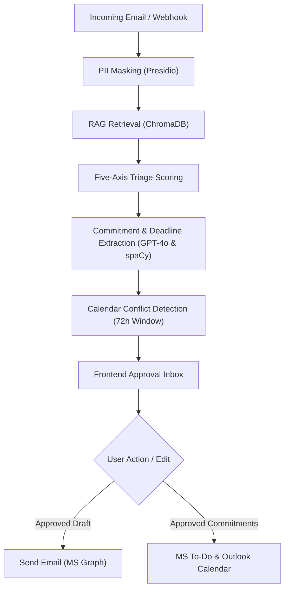

# MailMind v2 — Project Reference Guide

MailMind v2 is an AI-powered email productivity platform that helps knowledge workers prioritize emails, draft context-aware responses, extract commitments, and reduce inbox overload while keeping a human-in-the-loop for every outgoing message.

---

## 🏗️ System Architecture & Workflow

The core pipeline processes incoming emails through several intelligent layers before presenting them in the frontend dashboard for user approval:



---

## 🛠️ Technology Stack

### Backend
- **Framework**: FastAPI (Python 3.12+)
- **Runner**: Uvicorn
- **NLP & Entities**: spaCy (`en_core_web_sm`) for relative timeline parsing and deadline normalization.
- **Vector Database**: ChromaDB (local search index for sent precedents).
- **AI / LLMs**: Azure OpenAI (`gpt-4o`, `text-embedding-ada-002`).
- **Security**: Microsoft Presidio (PII scrubbing).
- **Authentication**: MSAL (Microsoft Authentication Library) for OAuth2 delegated token acquisition.

### Frontend
- **Framework**: Next.js 16.2.7 (React 19)
- **Styling**: Tailwind CSS 4
- **Language**: TypeScript 5

---

## 📂 Key Codebase Components

Click any path below to open the corresponding file directly in your editor:

### Backend Key Files
- [backend/app/main.py](file:///c:/Users/kmani/Documents/GitHub/mailmind/backend/app/main.py) — FastAPI initialization, lifespan handlers, and CORS/instrumentation configurations.
- [backend/app/config/settings.py](file:///c:/Users/kmani/Documents/GitHub/mailmind/backend/app/config/settings.py) — Configuration settings loaded from environment variables (e.g. thresholds, API endpoints, mock switches).
- [backend/app/api/routes.py](file:///c:/Users/kmani/Documents/GitHub/mailmind/backend/app/api/routes.py) — Routing layer exposing HTTP endpoints for the frontend.
- [backend/app/services/scorers.py](file:///c:/Users/kmani/Documents/GitHub/mailmind/backend/app/services/scorers.py) — Multi-axis classification scoring models (Deadline, Sender Authority, Sentiment, Decay, Action Type).
- [backend/app/services/commitments.py](file:///c:/Users/kmani/Documents/GitHub/mailmind/backend/app/services/commitments.py) — Parser and processor for calendar events/task confirmations.
- [backend/app/services/rag.py](file:///c:/Users/kmani/Documents/GitHub/mailmind/backend/app/services/rag.py) — Precedent indexer, semantic retriever, and PII-masking tools.

### Frontend Key Files
- [frontend/package.json](file:///c:/Users/kmani/Documents/GitHub/mailmind/frontend/package.json) — Scripts, project dependencies, and Tailwind post-css settings.
- [frontend/app/page.tsx](file:///c:/Users/kmani/Documents/GitHub/mailmind/frontend/app/page.tsx) — Login landing page with auth status check and MSAL device code flow trigger.
- [frontend/app/dashboard/page.tsx](file:///c:/Users/kmani/Documents/GitHub/mailmind/frontend/app/dashboard/page.tsx) — Entry dashboard page orchestrating state, custom hooks, and components.
- [frontend/components/](file:///c:/Users/kmani/Documents/GitHub/mailmind/frontend/components) — Modular components partitioned by feature (e.g. triage badges, commitments pane, mail list).
- [frontend/hooks/](file:///c:/Users/kmani/Documents/GitHub/mailmind/frontend/hooks) — Custom React hooks (`useEmails`, `useEmailDetail`, `useCommitments`, `useCalendar`) containing fetchers mapping to FastAPI backend.

---

## 🔌 API Contract Reference

The backend operates on port `8000` by default. Key APIs:

| Endpoint | Method | Input Payload / Header | Output / Behavior |
| :--- | :--- | :--- | :--- |
| `/api/health` | `GET` | None | Reports FastAPI instance status and ingestion queue size. |
| `/api/auth/status` | `GET` | None | Checks current user session (UPN, login state) on Microsoft Graph. |
| `/api/emails` | `GET` | `limit` (query parameter) | Retrieves recent user emails from Outlook Inbox folder. |
| `/api/triage` | `POST` | `EmailPayload` | Computes 5-axis score breakdown (deadline, authority, sentiment, decay, actionability) and returns composite result. |
| `/api/classify` | `POST` | `RAGQuery` | Runs GPT-4o classification with semantic categories and outputs confidence level. |
| `/api/commitments/extract` | `POST` | `CommitmentExtractionRequest` | Scans email text, normalizes deadlines using spaCy, returns potential todo items. |
| `/api/commitments/confirm` | `POST` | `CommitmentApprover`, Header: `x-approval-token` | Writes approved todo events directly to MS To-Do and meetings to Outlook Calendar. |
| `/api/rag/retrieve` | `POST` | `RAGQuery` | Cosine similarity query on ChromaDB to fetch matching PII-masked precedents. |

---

## 🚀 Local Development Quickstart

### Backend Activation
Navigate to backend directory, activate environment, resolve dependencies, and start FastAPI:
```powershell
cd backend
.venv\Scripts\Activate.ps1
python -m spacy download en_core_web_sm
python -m uvicorn app.main:app --host 127.0.0.1 --port 8000 --reload
```
API Documentation will be available at [http://127.0.0.1:8000/docs](http://127.0.0.1:8000/docs).

### Frontend Activation
Navigate to frontend directory, download modules, and boot dev server:
```powershell
cd frontend
npm install
npm run dev
```
The App workspace loads on [http://localhost:3000](http://localhost:3000).

---

## 📝 Change Log & Updates
This section tracks architectural shifts, feature additions, or configuration changes.

* **2026-06-05**: Created `PROJECT_REFERENCE.md` to document the core system architecture, key files list, API contracts, and development instructions.
* **2026-06-05**: Enforced strict API isolation using the `USE_MOCK_GRAPH` toggle. If `True`, all LLM-based and Graph-based operations (triage, commitment extraction, and embeddings) strictly route through local fallbacks and mock data, avoiding any network calls. If `False`, the system operates solely on live Azure OpenAI and Microsoft Graph endpoints, raising a `RuntimeError` if credentials are not configured. Updated the frontend dashboard to query status from backend and dynamically render a green "Live Account Connected" or yellow "Mock Mode Active" badge in the [Header](file:///c:/Users/kmani/Documents/GitHub/mailmind/frontend/components/layout/Header.tsx).
* **2026-06-05**: Overhauled the frontend routing architecture. Moved the login layout to the root path ([page.tsx](file:///c:/Users/kmani/Documents/GitHub/mailmind/frontend/app/page.tsx)), relocated the workspace dashboard to a dedicated path ([dashboard/page.tsx](file:///c:/Users/kmani/Documents/GitHub/mailmind/frontend/app/dashboard/page.tsx)), and removed the redundant/legacy `login/` directory. Added a dynamic switch at the root `/` level: if the backend is in Mock Mode (which is authenticated by default), it renders the dashboard layout directly without showing the login screen. If in Live Mode (unauthenticated), it renders the Microsoft login interface.
* **2026-06-05**: Redesigned the prioritized inbox layout on the dashboard. By default, when no email is selected, only the inbox list is displayed taking up the full layout width. Selecting an email narrows the list to show details side-by-side. Added a "Back to Inbox" action toolbar to the top of [EmailDetail.tsx](file:///c:/Users/kmani/Documents/GitHub/mailmind/frontend/components/detail/EmailDetail.tsx) to allow closing the details panel and returning to the full-width list view.
* **2026-06-05**: Renamed the inbox display header from `"Prioritized Inbox"` to `"Inbox"` and introduced full sidebar support for all other typical folders: **Drafts**, **Sent**, **Spam**, **Trash**, **Social**, and **Promotions** with a layout divider separating mailboxes from settings. Created high-fidelity mock datasets in [mockData.ts](file:///c:/Users/kmani/Documents/GitHub/mailmind/frontend/lib/mockData.ts) for these new boxes, making the `useEmails` hook folder-aware to load the correct context on active tab switches.
* **2026-06-05**: Implemented Starred and Important mailbox filter folders. Added interactive click-to-toggle star icons to all email list item cards, supporting immediate state changes in all views. Structured the folder navigation in `Sidebar.tsx` into a collapsible hierarchy: `Inbox` and `Sent` remain primary, while `Starred`, `Important`, `Drafts`, `Trash`, `Spam`, `Social`, and `Promotions` are collapsed under an interactive "More / Less" toggle button to declutter the user interface.
