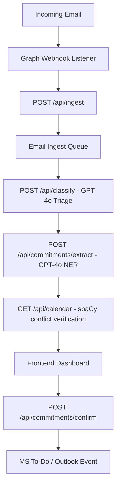

# MailMind v2 — Full-Stack Developer Onboarding Guide

Date: 2026-06-04
Target Audience: Full-Stack Developers / Frontend Developers

---

## 1. System Architecture Overview

MailMind v2 is an intelligent email agent designed to automate the **Triage → Draft → Approve & Write** workflow. 



- **Backend**: FastAPI web server (port 8000), spaCy (for NER date parsing), Azure OpenAI (for GPT-4o triage and commitment extraction), and ChromaDB (for local vector indexing).
- **Frontend**: A dashboard to display prioritized inbox triage results, view extracted action items/commitments side-by-side with calendar conflict indicators, and confirm actions (writing back to Microsoft To-Do and Calendar).

---

## 2. Backend REST API Reference

The backend exposes the following primary endpoints for your frontend to consume:

### Ingestion & Webhooks
* **`POST /api/ingest`**: Receives incoming email data (`email_id`, `sender`, `subject`, `body`, `received_at`) from the webhook receiver, queues it, and returns immediately with a `200` response.

### Intelligent Triage
* **`POST /api/classify`**: Runs GPT-4o classification with few-shot prompting and deterministic fallback mapping.
  - *Response*: Returns a five-axis triage score (deadline, authority, sentiment, decay, action) along with a composite score (0-100), priority level (`CRITICAL`, `HIGH`, `MEDIUM`, `LOW`), and approval mode (`GATE` or `SUGGEST`).

### Commitments & Calendar Conflicts
* **`POST /api/commitments/extract`**: Uses GPT-4o to parse commitments, action items, and deadlines.
  - *Response*: Returns an array of extracted commitments with deadlines and confidence scores. Deadlines are automatically normalized to ISO 8601 using spaCy NER.
* **`GET /api/calendar`**: Fetches the user's Microsoft Calendar events for the next 72 hours.
* **`POST /api/commitments/confirm`**: Writes approved commitments back to the Microsoft Graph API.
  - *Payload*: `{email_id: str, commitments: [{id: str, approved: bool}]}`
  - *Behavior*: Approved items write tasks to MS To-Do and meetings to Outlook Calendar.
  - *Response*: `{success: bool, task_urls: [str], event_urls: [str]}`

### RAG Precedent Retriever
* **`POST /api/rag/retrieve`**: Performs a cosine similarity search on sent email history.
  - *Response*: Returns top-3 matching precedent emails (PII masked) to help the UI draft appropriate response templates.

---

## 3. Environment & Local Setup

### Setup Backend Environment
Ensure the virtual environment is active, spaCy model is downloaded, and the server is running:

```powershell
# 1. Navigate to the backend directory
Set-Location 'C:\Users\kmani\Downloads\MailMind\mailmind-v2\backend'

# 2. Activate Python Virtual Environment
.venv\Scripts\Activate.ps1

# 3. Ensure spaCy model is installed
python -m spacy download en_core_web_sm

# 4. Start the FastAPI development server
python -m uvicorn app.main:app --host 127.0.0.1 --port 8000 --reload
```

### Credentials (`.env`)
The backend looks for `.env` at `mailmind-v2/backend/.env`. Key configurations:
- `USE_MOCK_GRAPH=true` (Uses mock Microsoft Graph data for local development)
- `AZURE_OPENAI_API_KEY` & `AZURE_OPENAI_ENDPOINT` (Required for live GPT-4o integration)
- `OPENAI_API_KEY` (Standard OpenAI credentials fallback if Azure is not configured)

---

## 4. Guidelines for Building the Frontend Dashboard

To match our high design aesthetics, we recommend building the UI using **React (via Vite or Next.js)** and **Vanilla CSS**.

### Color System & UI Themes
- Avoid raw browser defaults or plain colors. Instead, curate a clean dark-mode friendly HSL palette:
  - **Background**: `hsl(224, 25%, 12%)` (deep dark blue-gray)
  - **Card / Surface**: `hsl(224, 22%, 18%)`
  - **Primary / Active Accent**: `hsl(263, 70%, 50%)` (electric indigo)
  - **Success / Badge**: `hsl(142, 70%, 45%)` (emerald green)
  - **Warning / Badges**: `hsl(38, 92%, 50%)` (amber yellow)
  - **Critical Alert**: `hsl(0, 84%, 60%)` (crimson red)

### Recommended Dashboard Layout
1. **Prioritized Inbox View**: Display emails sorted by their triage composite priority score (0-100). Add color-coded indicators (`CRITICAL` = Red, `HIGH` = Orange, etc.).
2. **Detail Panel / Thread**: When an email is selected, display the conversation thread side-by-side with RAG-generated response suggestions and precedent citations.
3. **Commitment Gate Panel**: 
   - Render the extracted action items with checkbox selectors.
   - Display a visual "Conflict Warning Badge" alongside any action item whose parsed deadline overlaps with calendar events inside the 72-hour window.
   - Include a "Confirm and Write" action button that triggers the `POST /api/commitments/confirm` API call.

---

## 5. Next Handoff Steps

1. **Initialize Frontend Repository**: Set up Vite React or Next.js in a new sibling directory `/frontend`.
2. **Wire Up APIs**: Map API endpoints using fetch/Axios to the port `8000` FastAPI server.
3. **Set Up CORS Configuration**: Ensure `app/main.py` is configured with backend CORS headers allowing your frontend port origins.
4. **Deploy Production Environment**: Configure real environment variables (`AZURE_TENANT_ID`, client credentials, Azure OpenAI keys) on your target hosting platform (e.g., Azure App Service, Vercel/Railway).
